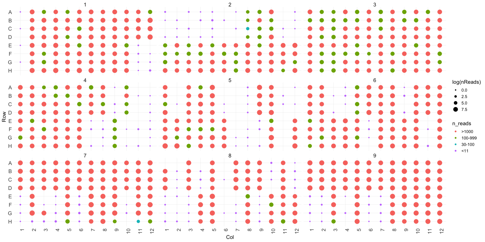
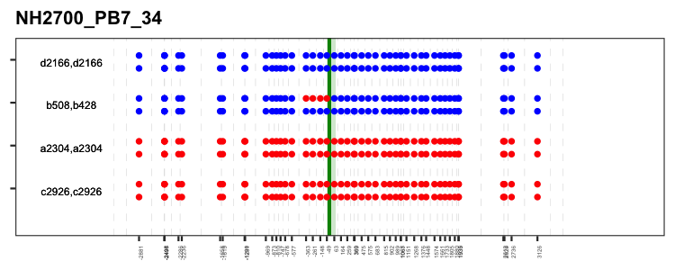
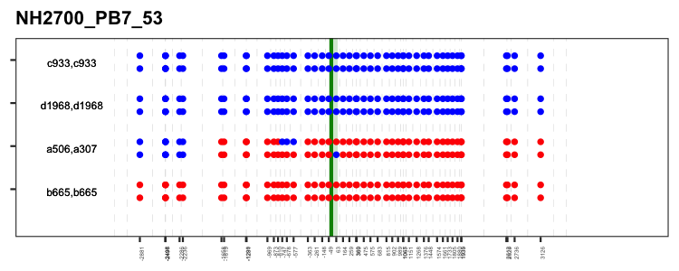

Scripts to phase 48 SNPs over a 6kb region
================
Last compiled on January, 01 2023

# Objectives

- Design of primers with barcodes for multiplexing 864 amplicon samples
- 6kb PCR amplification of two haplotypes per sample
- An R script for bining fasta/fastq files based on read-names
- Snakemake setup and commands to align, sort, index, flag and
  recaliberate PacBio reads
- Plot alignments in R using Gviz and VariantAnnotation (Better
  annotation coming soon!)
- Determination of haplotypes (semi-manually) and plotting tetrads.

# DESIGN: Interval for Analysis of Recombinants


# Setup

## Primers

Primers for multiplexing are in the [attached
excel](Expt_Setup/Barcoded_Primers_for_Pacbio_Multiplexing.xlsx)

# Input files

## The samplesheet

we need a samplesheet which correlates barcodes to samples, tetrads and
spores. Here:
[PB7_NH2700_JA_meta.xlsx](samplesheet/PB7_NH2700_JA_meta.xlsx).

``` r
library(readxl)
read_excel("samplesheet/PB7_NH2700_JA_meta.xlsx", n_max = 3) %>%
  kable(caption = "samplesheet") %>% 
  kable_styling(full_width = F, position = "left", font_size = 7)
```

<table class="table" style="font-size: 7px; width: auto !important; ">
<caption style="font-size: initial !important;">
samplesheet
</caption>
<thead>
<tr>
<th style="text-align:right;">
PCR
</th>
<th style="text-align:right;">
Plate
</th>
<th style="text-align:left;">
Sample
</th>
<th style="text-align:right;">
Col_barcode
</th>
<th style="text-align:right;">
Row_barcode
</th>
<th style="text-align:left;">
spore
</th>
<th style="text-align:right;">
tetrad
</th>
<th style="text-align:left;">
row
</th>
<th style="text-align:right;">
col
</th>
<th style="text-align:left;">
rev_barcode_5to3
</th>
<th style="text-align:left;">
fwd_barcode_5to3
</th>
</tr>
</thead>
<tbody>
<tr>
<td style="text-align:right;">
1
</td>
<td style="text-align:right;">
1
</td>
<td style="text-align:left;">
2a
</td>
<td style="text-align:right;">
312
</td>
<td style="text-align:right;">
324
</td>
<td style="text-align:left;">
a
</td>
<td style="text-align:right;">
2
</td>
<td style="text-align:left;">
A
</td>
<td style="text-align:right;">
1
</td>
<td style="text-align:left;">
TCATATGTAGTACTCT
</td>
<td style="text-align:left;">
GCGCTCTGTGTGCAGC
</td>
</tr>
<tr>
<td style="text-align:right;">
2
</td>
<td style="text-align:right;">
1
</td>
<td style="text-align:left;">
2b
</td>
<td style="text-align:right;">
312
</td>
<td style="text-align:right;">
325
</td>
<td style="text-align:left;">
b
</td>
<td style="text-align:right;">
2
</td>
<td style="text-align:left;">
B
</td>
<td style="text-align:right;">
1
</td>
<td style="text-align:left;">
GCGATCTATGCACACG
</td>
<td style="text-align:left;">
GCGCTCTGTGTGCAGC
</td>
</tr>
<tr>
<td style="text-align:right;">
3
</td>
<td style="text-align:right;">
1
</td>
<td style="text-align:left;">
2c
</td>
<td style="text-align:right;">
312
</td>
<td style="text-align:right;">
326
</td>
<td style="text-align:left;">
c
</td>
<td style="text-align:right;">
2
</td>
<td style="text-align:left;">
C
</td>
<td style="text-align:right;">
1
</td>
<td style="text-align:left;">
TGCAGTCGAGATACAT
</td>
<td style="text-align:left;">
GCGCTCTGTGTGCAGC
</td>
</tr>
</tbody>
</table>

## The fastq file.

[Ahuja et al., 2021](https://pubmed.ncbi.nlm.nih.gov/34453891/) was done using mostly Illumina and few Pacbio reads
and therefore to focus on Pacbio reads lets use the [Zeisel et al.](https://pubmed.ncbi.nlm.nih.gov/36508468/),
dataset.

The raw reads from Zeisel et al., 2022 (PB7_NH2700.ccs.fastq) are
deposited with the ID: \[PRJNA873686\]
(<https://www.ncbi.nlm.nih.gov/bioproject/?term=PRJNA873686>)

``` r
PacBio_Reads <- "../raw_data/PB7_NH2700.ccs.fastq"
```

# Bin reads into samples

## Identify the barcodes on reads.

cmd: Seqkit_barcodeID.sh {../raw_data/PB7_NH2700.ccs.fastq}
{Fwd_barcodes.fasta} {Rev_barcodes.fasta}  
To accomplish this I use [Seqkit](https://bioinf.shenwei.me/seqkit/).  
And for reproducibility, I have written it in a bash script
[Seqkit_barcodeID.sh](A_barcodeID/Seqkit_barcodeID.sh)  
it uses barcodes in fasta format as in files:
[Fwd_barcodes.fasta](A_barcodeID/Fwd_barcodes.fasta)  
and [Rev_barcodes.fasta](A_barcodeID/Fwd_barcodes.fasta)

The output barcode ID files generated are: Fwd_barcode_scan.tsv and
Rev_barcode_scan.tsv

``` r
read_tsv("A_barcodeID/Fwd_barcode_scan.tsv", n_max = 3) %>% 
  kable(caption = "Fwd_barcode_scan.tsv") %>% 
  kable_styling(full_width = F, position = "left", font_size = 7)
```

<table class="table" style="font-size: 7px; width: auto !important; ">
<caption style="font-size: initial !important;">
Fwd_barcode_scan.tsv
</caption>
<thead>
<tr>
<th style="text-align:left;">
seqID
</th>
<th style="text-align:right;">
patternName
</th>
<th style="text-align:left;">
pattern
</th>
<th style="text-align:left;">
strand
</th>
<th style="text-align:right;">
start
</th>
<th style="text-align:right;">
end
</th>
<th style="text-align:left;">
matched
</th>
</tr>
</thead>
<tbody>
<tr>
<td style="text-align:left;">
m64235e_211010_194745/68080/ccs
</td>
<td style="text-align:right;">
373
</td>
<td style="text-align:left;">
cgatcatctatagaca
</td>
<td style="text-align:left;">

- </td>
  <td style="text-align:right;">
  1
  </td>
  <td style="text-align:right;">
  16
  </td>
  <td style="text-align:left;">
  cgatcatctatagaca
  </td>
  </tr>
  <tr>
  <td style="text-align:left;">
  m64235e_211010_194745/133967/ccs
  </td>
  <td style="text-align:right;">
  373
  </td>
  <td style="text-align:left;">
  cgatcatctatagaca
  </td>
  <td style="text-align:left;">

  - </td>
    <td style="text-align:right;">
    1
    </td>
    <td style="text-align:right;">
    16
    </td>
    <td style="text-align:left;">
    cgatcatctatagaca
    </td>
    </tr>
    <tr>
    <td style="text-align:left;">
    m64235e_211010_194745/197183/ccs
    </td>
    <td style="text-align:right;">
    373
    </td>
    <td style="text-align:left;">
    cgatcatctatagaca
    </td>
    <td style="text-align:left;">

    - </td>
      <td style="text-align:right;">
      1
      </td>
      <td style="text-align:right;">
      16
      </td>
      <td style="text-align:left;">
      cgatcatctatagaca
      </td>
      </tr>
      </tbody>
      </table>

``` r
read_tsv("A_barcodeID/Rev_barcode_scan.tsv", n_max = 3) %>% 
  kable(caption = "Rev_barcode_scan.tsv") %>% 
  kable_styling(full_width = F, position = "left", font_size = 7)
```

<table class="table" style="font-size: 7px; width: auto !important; ">
<caption style="font-size: initial !important;">
Rev_barcode_scan.tsv
</caption>
<thead>
<tr>
<th style="text-align:left;">
seqID
</th>
<th style="text-align:right;">
patternName
</th>
<th style="text-align:left;">
pattern
</th>
<th style="text-align:left;">
strand
</th>
<th style="text-align:right;">
start
</th>
<th style="text-align:right;">
end
</th>
<th style="text-align:left;">
matched
</th>
</tr>
</thead>
<tbody>
<tr>
<td style="text-align:left;">
m64235e_211010_194745/68080/ccs
</td>
<td style="text-align:right;">
328
</td>
<td style="text-align:left;">
tacagcgacgtcatcg
</td>
<td style="text-align:left;">

- </td>
  <td style="text-align:right;">
  6899
  </td>
  <td style="text-align:right;">
  6914
  </td>
  <td style="text-align:left;">
  tacagcgacgtcatcg
  </td>
  </tr>
  <tr>
  <td style="text-align:left;">
  m64235e_211010_194745/133967/ccs
  </td>
  <td style="text-align:right;">
  328
  </td>
  <td style="text-align:left;">
  tacagcgacgtcatcg
  </td>
  <td style="text-align:left;">

  - </td>
    <td style="text-align:right;">
    6874
    </td>
    <td style="text-align:right;">
    6889
    </td>
    <td style="text-align:left;">
    tacagcgacgtcatcg
    </td>
    </tr>
    <tr>
    <td style="text-align:left;">
    m64235e_211010_194745/197183/ccs
    </td>
    <td style="text-align:right;">
    328
    </td>
    <td style="text-align:left;">
    tacagcgacgtcatcg
    </td>
    <td style="text-align:left;">

    - </td>
      <td style="text-align:right;">
      6872
      </td>
      <td style="text-align:right;">
      6887
      </td>
      <td style="text-align:left;">
      tacagcgacgtcatcg
      </td>
      </tr>
      </tbody>
      </table>

## Bin reads

cmd: Make_fasta_folders_sReads.R {samplesheet} {raw fastq}
{Fwd_barcode_scan.tsv} {Rev_barcode_scan.tsv}  
To accomplish binning I wrote a script
[Make_fasta_folders_sReads.R](C_split_fastqs/Make_fasta_folders_sReads.R)  
which uses a
[samplesheet](../B_barcode_report/PB7_NH2700_JA_meta.xlsx)  
reads e.g., raw_data/PB7_sample.fastq  
and creates barcode reports for [forward
barcodes](A_barcodeID/Fwd_barcode_scan.tsv) and  
[reverse barcodes](../A_barcodeID/Rev_barcode_scan.tsv)

The output is:
(samplesheet_with_both_codes.RDS)\[C_split_fastqs/samplesheet_with_codes.tsv\]
and binned fastq files in a subfolder with the name matching name of the
samplesheet

``` r
samplesheet_with_both_codes <- read_tsv("C_split_fastqs/samplesheet_with_codes.tsv")


samplesheet_with_both_codes   %>% 
  slice_head(n=3) %>%
  kable(caption = "Rev_barcode_scan.tsv") %>% 
  kable_styling(full_width = F, position = "left", font_size = 7)
```

<table class="table" style="font-size: 7px; width: auto !important; ">
<caption style="font-size: initial !important;">
Rev_barcode_scan.tsv
</caption>
<thead>
<tr>
<th style="text-align:left;">
seqID
</th>
<th style="text-align:right;">
Col_barcode
</th>
<th style="text-align:left;">
fwd_barcode_5to3
</th>
<th style="text-align:right;">
Row_barcode
</th>
<th style="text-align:left;">
rev_barcode_5to3
</th>
<th style="text-align:right;">
PCR
</th>
<th style="text-align:right;">
Plate
</th>
<th style="text-align:left;">
Sample
</th>
<th style="text-align:left;">
spore
</th>
<th style="text-align:right;">
tetrad
</th>
<th style="text-align:left;">
row
</th>
<th style="text-align:right;">
col
</th>
</tr>
</thead>
<tbody>
<tr>
<td style="text-align:left;">
m64235e_211010_194745/68430/ccs
</td>
<td style="text-align:right;">
319
</td>
<td style="text-align:left;">
CTGCTAGAGTCTACAG
</td>
<td style="text-align:right;">
328
</td>
<td style="text-align:left;">
TACAGCGACGTCATCG
</td>
<td style="text-align:right;">
61
</td>
<td style="text-align:right;">
1
</td>
<td style="text-align:left;">
34a
</td>
<td style="text-align:left;">
a
</td>
<td style="text-align:right;">
34
</td>
<td style="text-align:left;">
E
</td>
<td style="text-align:right;">
8
</td>
</tr>
<tr>
<td style="text-align:left;">
m64235e_211010_194745/198831/ccs
</td>
<td style="text-align:right;">
319
</td>
<td style="text-align:left;">
CTGCTAGAGTCTACAG
</td>
<td style="text-align:right;">
328
</td>
<td style="text-align:left;">
TACAGCGACGTCATCG
</td>
<td style="text-align:right;">
61
</td>
<td style="text-align:right;">
1
</td>
<td style="text-align:left;">
34a
</td>
<td style="text-align:left;">
a
</td>
<td style="text-align:right;">
34
</td>
<td style="text-align:left;">
E
</td>
<td style="text-align:right;">
8
</td>
</tr>
<tr>
<td style="text-align:left;">
m64235e_211010_194745/264618/ccs
</td>
<td style="text-align:right;">
319
</td>
<td style="text-align:left;">
CTGCTAGAGTCTACAG
</td>
<td style="text-align:right;">
328
</td>
<td style="text-align:left;">
TACAGCGACGTCATCG
</td>
<td style="text-align:right;">
61
</td>
<td style="text-align:right;">
1
</td>
<td style="text-align:left;">
34a
</td>
<td style="text-align:left;">
a
</td>
<td style="text-align:right;">
34
</td>
<td style="text-align:left;">
E
</td>
<td style="text-align:right;">
8
</td>
</tr>
</tbody>
</table>

## Coverage per sample:

Read distribution across the 864 samples in 9 plates in a 3 by 3
orientation.  
This is using all the samples for this run.

``` r
samplesheet_COMPLETE_PB7 <- readRDS("C_split_fastqs/samplesheet_with_both_codes_Not_Sample.RDS")
samples_seq_summary <- samplesheet_COMPLETE_PB7 %>%
                          group_by(PCR, Plate, row, col, Sample, tetrad, spore) %>%
                          summarize(nReads=length(unique(seqID)), read_names=paste0(unique(seqID), collapse=","))

samples_seq_summary <- samples_seq_summary %>% mutate(Col = as.numeric(col), Row=row)

samples_seq_summary$Row <- factor(samples_seq_summary$Row, levels = c("H", "G", "F", "E", "D", "C", "B", "A"))

samples_seq_summary$Plate <- factor(samples_seq_summary$Plate, levels = c("1", "2", "3", "4", "5", "6", "7", "8", "9"))

samples_sheet.summ <- samples_seq_summary  %>% 
  group_by(Col, Row, PCR, nReads) %>%
  mutate(n_reads = case_when(
    nReads > 999 ~ ">1000",
    nReads > 100 & nReads < 1000 ~ "100-999",
    nReads > 30 & nReads < 100 ~ "30-100",
    nReads < 30 & nReads > 10 ~ "11-29",
    nReads < 11  ~ "<11",
    TRUE ~ "WHY"
  ))
samples_sheet.summ$n_reads <- factor(samples_sheet.summ$n_reads, 
                                    levels = c(">1000", "100-999", "30-100", "11-29", "<11", "WHY"))

geom.text.size = 5

theme.size = (14/5) * geom.text.size

theme_JA_legend <- theme(
  axis.text.x = element_text(angle = 90, hjust = 1, size=theme.size), 
  strip.text.x = element_text(margin = margin(0,0,0,0, "in")),
  axis.title.x = element_text(size=theme.size),
  strip.text = element_text(size = theme.size),
  axis.text.y=element_text(size=theme.size),
  text = element_text(size = theme.size),
  #                         axis.title = element_blank(),
  panel.grid.minor.x = element_blank(),
  panel.grid.minor.y = element_line(linewidth = 0.1, linetype = 'solid', colour = "gray90"),
  panel.grid.major = element_line(linewidth = 0.1, linetype = 'solid', colour = "gray80"),
  # legend.position='none'
  #                         panel.grid.minor.y = element_blank(),
  #                         legend.key.size = unit(0.5,"line"),
  #                         legend.title = element_blank()
  #       #                 legend.text = element_text(color = col_ors)
  # legend.justification = c(1, 1), legend.position = c(1, 1)
)

heat_plot_wells <- ggplot(samples_sheet.summ %>% filter(!is.na(Plate)), aes(x=Col, y=Row, color=n_reads))+
                        geom_point(aes(size=log(nReads)))+
                        facet_wrap(~Plate, ncol=3)+
                        theme_minimal()+
                        scale_x_continuous(breaks=seq(0,12,1))+
                        theme_JA_legend+
                        scale_fill_distiller()+
                        scale_radius()

heat_plot_wells
```



# Score SNPs

To do this, I use snakemake, it ensures reproducibility also splitting a
big fastq to many individual fastq’s and their independent alignment,
base, calling and phasing allows to spread the processing onto many
cores and allows for flexibility and scalability of the procedure.

## REQUIREMENTS

coded in [Pacio_PB7.py](D_alignment_calling/scripts/Pacbio_PB7.py)

This file needs:

- JA Custom Scripts and helpers  
  MAKE_PRE_S2T = “D_alignment_calling/scripts/JA_make_pre.sam2tsv.R”  
  CUT_HAPL = “D_alignment_calling/scripts/JA_create.haplotypes.CUT.R”  
  MAKE_SPREAD_PLOTS =
  “D_alignment_calling/scripts/JA_make.spread.plots.V3.R”  
  PLOT_BAM = “D_alignment_calling/scripts/JA_plotbam.recalBams.R”  
  GENOME =
  “D_alignment_calling/scripts/Pacbio_STE50toFUS1/STE50toFUS1_S4921”

- N_READS_CUT removes haplotypes less than N and also only top N
  haplotypes are plotted  
  N_READS_CUT = 7

- some inputs and  
  PBPRE = {prefix for outputs}  
  JA_OUT = FOLDER = PBPRE+“/” - I reuse the prefix as output folder
  name.  
  SAMPLESHEET = {location of samplesheet}  
  DATA = {folder which has split fastq files from step-2 above}  
  TMPR = “temp” - location of temporary directory

- some prerequisite packages:  
  [GATK](https://gatk.broadinstitute.org/hc/en-us) - {location of GATK
  installation}  
  [PICARD](https://broadinstitute.github.io/picard/) - {location of
  picard installation}  
  [SAM2TSV](https://lindenb.github.io/jvarkit/) - {location of sam2tsv
  installation}

- derive sample names from filenames in the binned reads folder  
  samples, = glob_wildcards(DATA+“{sample}.fastq”)

## ALIGNMENT

script:
[Pacbio_alignment_dedup_ETC_fastq.py](D_alignment_calling/scripts/Pacbio_alignment_dedup_ETC_fastq.py)

- map reads using [minimap2](https://github.com/lh3/minimap2)
- sort and index reads using [samtools](https://github.com/samtools/)
- add headers using [picard](https://broadinstitute.github.io/picard/)
- recaliberate alignment using
  [GATK](https://gatk.broadinstitute.org/hc/en-us)

## HAPLOTYPE

custom scripts called via
[haplotype_JA_steps.py](D_alignment_calling/scripts/haplotype_JA_steps.py)

- the bam files can now be plotted using custom script -
  [PLOT_BAM](D_alignment_calling/scripts/JA_plotbam.recalBams.R)  
- [SAM2TSV](https://lindenb.github.io/jvarkit/) allows us to determine
  nucleotide per position per read in a table format  
- for insertions and deletions, consecutive positions with same
  reference coordinates are combined
  [MAKE_PRE_S2T](D_alignment_calling/scripts/JA_make_pre.sam2tsv.R)  
- Custom script
  [CUT_HAPL](D_alignment_calling/scripts/JA_create.haplotypes.CUT.R) is
  used to:
  - filter positions with polymorphisms  
  - reads which are not informative for all positions are removed  
  - turn nucleotides to parent-1 (W, blue or no-snps) and Parent-2 (S,
    red or with-snps) annotation
  - also haplotypes supported by less than N reads are removed  
- Now we plot the haplotypes detected and also write an excel with the
  most plausible strand-haplotypes.

## DISCUSSION

- At this point, I inspect the haplotype plots per sample very carefully
  and note the haplotypes (using n_reads as ID) for strand-1 and
  strand-2 per sample. This is crucial!  
- The process can be made quite efficient using
  [pysam](https://pysam.readthedocs.io/en/latest/api.html) library to
  pull the nucleotides mapping to particular positions efficiently. This
  is alternate to getting nucleotides at all positions and then
  filtering for required positions. I have a script, which I will share
  shortly. But at the time (2018) I thought why fix what ain’t broken!

## OUTPUT

1- [pdf for
haplotypes](D_alignment_calling/output/PB7_align_spore_plots.CUT.V2.pdf)  
2- [RDS file with all plausible haplotypes underlying the
pdf](D_alignment_calling/output/PB7_align_plots.CUT.V2.RDS).

``` r
PB7_align_plots.CUT.V2 <- readRDS("D_alignment_calling/output/PB7_align_plots.CUT.V2.RDS") 

PB7_align_plots.CUT.V2[c(1:3),] %>%
    kable(caption = "PB7_align_plots.CUT.V2.RDS") %>% 
    kable_styling(full_width = F, position = "left", font_size = 7)
```

<table class="table" style="font-size: 7px; width: auto !important; ">
<caption style="font-size: initial !important;">
PB7_align_plots.CUT.V2.RDS
</caption>
<thead>
<tr>
<th style="text-align:left;">
row_n
</th>
<th style="text-align:right;">
PCR
</th>
<th style="text-align:right;">
nReads
</th>
<th style="text-align:left;">
Position
</th>
<th style="text-align:left;">
Parent
</th>
</tr>
</thead>
<tbody>
<tr>
<td style="text-align:left;">
1
</td>
<td style="text-align:right;">
9
</td>
<td style="text-align:right;">
2225
</td>
<td style="text-align:left;">
2585
</td>
<td style="text-align:left;">
W
</td>
</tr>
<tr>
<td style="text-align:left;">
1
</td>
<td style="text-align:right;">
9
</td>
<td style="text-align:right;">
2225
</td>
<td style="text-align:left;">
2968
</td>
<td style="text-align:left;">
W
</td>
</tr>
<tr>
<td style="text-align:left;">
1
</td>
<td style="text-align:right;">
9
</td>
<td style="text-align:right;">
2225
</td>
<td style="text-align:left;">
2969
</td>
<td style="text-align:left;">
W
</td>
</tr>
</tbody>
</table>

# PLOTTING TETRADS.

## Manually select strand haplotypes

At this point it should be simple to look at the [pdf for
haplotypes](D_alignment_calling/output/PB7_align_spore_plots.CUT.V2.pdf)
and score which haplotypes you need to use for strands. Hint - use the
nReads (red/blue colored number) or row_n from y-axis as the haplotype
identifier.

``` r
chosen_strands_final <- readRDS("E_plotting_tetrads/input/chosen_strands_final.RDS") 

chosen_strands_final[c(1:3),] %>%
    kable(caption = "chosen strands") %>% 
    kable_styling(full_width = F, position = "left", font_size = 7)
```

<table class="table" style="font-size: 7px; width: auto !important; ">
<caption style="font-size: initial !important;">
chosen strands
</caption>
<thead>
<tr>
<th style="text-align:right;">
PCR
</th>
<th style="text-align:left;">
Pacbio_run
</th>
<th style="text-align:left;">
Sample
</th>
<th style="text-align:right;">
Plate
</th>
<th style="text-align:left;">
rev_barcode_5to3
</th>
<th style="text-align:left;">
fwd_barcode_5to3
</th>
<th style="text-align:left;">
spore
</th>
<th style="text-align:right;">
tetrad
</th>
<th style="text-align:left;">
row
</th>
<th style="text-align:right;">
col
</th>
<th style="text-align:left;">
strand
</th>
<th style="text-align:right;">
nReads
</th>
<th style="text-align:right;">
y_axis
</th>
</tr>
</thead>
<tbody>
<tr>
<td style="text-align:right;">
9
</td>
<td style="text-align:left;">
PB7
</td>
<td style="text-align:left;">
4a
</td>
<td style="text-align:right;">
1
</td>
<td style="text-align:left;">
TCATATGTAGTACTCT
</td>
<td style="text-align:left;">
TCATGAGTCGACACTA
</td>
<td style="text-align:left;">
a
</td>
<td style="text-align:right;">
4
</td>
<td style="text-align:left;">
A
</td>
<td style="text-align:right;">
2
</td>
<td style="text-align:left;">
strand1
</td>
<td style="text-align:right;">
2225
</td>
<td style="text-align:right;">
4.0
</td>
</tr>
<tr>
<td style="text-align:right;">
9
</td>
<td style="text-align:left;">
PB7
</td>
<td style="text-align:left;">
4a
</td>
<td style="text-align:right;">
1
</td>
<td style="text-align:left;">
TCATATGTAGTACTCT
</td>
<td style="text-align:left;">
TCATGAGTCGACACTA
</td>
<td style="text-align:left;">
a
</td>
<td style="text-align:right;">
4
</td>
<td style="text-align:left;">
A
</td>
<td style="text-align:right;">
2
</td>
<td style="text-align:left;">
strand2
</td>
<td style="text-align:right;">
2225
</td>
<td style="text-align:right;">
3.7
</td>
</tr>
<tr>
<td style="text-align:right;">
10
</td>
<td style="text-align:left;">
PB7
</td>
<td style="text-align:left;">
4b
</td>
<td style="text-align:right;">
1
</td>
<td style="text-align:left;">
GCGATCTATGCACACG
</td>
<td style="text-align:left;">
TCATGAGTCGACACTA
</td>
<td style="text-align:left;">
b
</td>
<td style="text-align:right;">
4
</td>
<td style="text-align:left;">
B
</td>
<td style="text-align:right;">
2
</td>
<td style="text-align:left;">
strand1
</td>
<td style="text-align:right;">
1429
</td>
<td style="text-align:right;">
2.0
</td>
</tr>
</tbody>
</table>

## Left-join to get the strand-haplotype dataframe

Then you can left join the output from alignment and filter for the
required tetrads spores and strands.

``` r
NH2700_plotData <- left_join(PB7_align_plots.CUT.V2, chosen_strands_final, by = c("PCR", "nReads"))
```

## Write the excel file with strand haplotypes

For making a visual friendly [excel
file](E_plotting_tetrads/output/NH2700_plotData.xlsx) one can pivot this
table wider, or transpose

``` r
NH2700_plotData_transposed <- NH2700_plotData %>%
                              ungroup() %>%
                              group_by(row_n, PCR, nReads, Pacbio_run, Sample, Plate, rev_barcode_5to3, fwd_barcode_5to3, spore, tetrad, row, col, strand, y_axis) %>%
                              pivot_wider(names_from = Position, values_from = Parent)
library(openxlsx)
write.xlsx(NH2700_plotData_transposed, "E_plotting_tetrads/output/NH2700_plotData.xlsx")
```

## TETRAD PLOTS

This data can now be used for plotting using a [custom
function](E_plotting_tetrads/script/PlotFunctions_2021_git.R)  
The title contains label_pre = “NH2700_PB7\_” and “tetrad_name”.  
The alphanumeric on the left is = spore strand1_reads, spore
strand2_reads.  
green-line is at the DSB site position 5466, the coordinates on x-axis
are Position-5466.

``` r
source("E_plotting_tetrads/script/PlotFunctions_2021_git.R")

NH2700_plotData <- NH2700_plotData %>%
                    mutate(snp_start = as.numeric(Position)-5466,
                           P = Parent)
saveRDS(NH2700_plotData, "E_plotting_tetrads/output/NH2700_plotData.RDS")

## lapply(sort(unique(NH2700_plotData$tetrad)), plotpertetradshiny, label_pre = "NH2700_PB7_", tetradData1 = NH2700_plotData)

lapply(c(34, 53), plotpertetradshiny, label_pre = "NH2700_PB7_", tetradData1 = NH2700_plotData)
```

<!-- --><!-- -->

# Comments (My opinions!) /Quicktakes

- I highly recommend tidyverse, GenomicRanges, Snakemake, jvarkit and
  Seqkit
- Seqkit is the fastest and most robust way to identify motifs/barcodes
- Snakemake is a robust way to do parallel tasks on multiple cores
  (HPC-environment)
- Best out of the box method to determine nucleotides at given positions
  per read is - jvarkit

# Introduction

- coming up soon, skip for now -
- may need to fix links to -
  - [detecting number of
    cores](D_alignment_calling/scripts/detectBatchCPUs.R)
  - [standards for SNP typing](Snp_typing_standard/PBStandard.RDS)
- 
